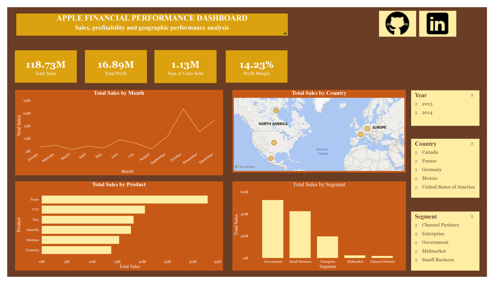
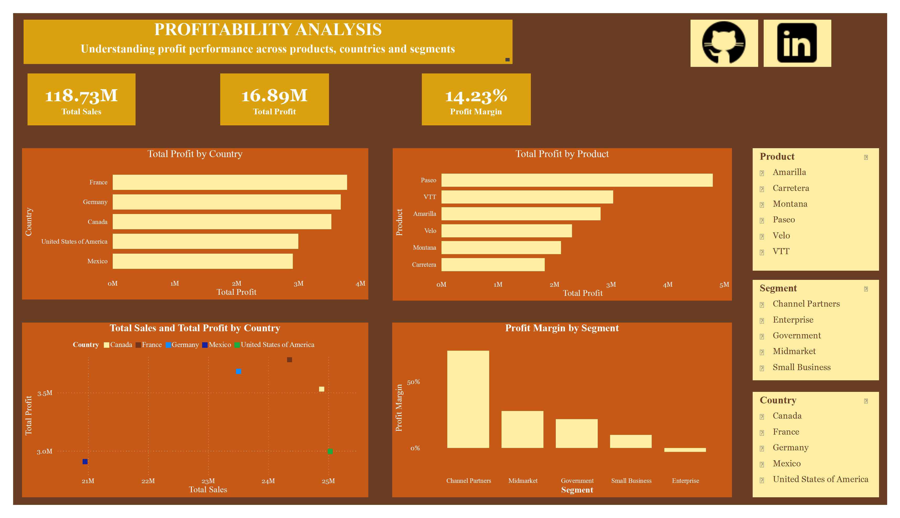

# Apple Financial Performance Dashboard

## Project Overview

An interactive Power BI dashboard built to analyze Apple's financial performance across sales, profit, products, countries, business segments, and time.

The project demonstrates practical data analysis, data modeling, DAX, and dashboard design skills relevant to a Data Analyst role.

## Objectives

- Analyze overall sales and profitability performance.
- Identify top-performing products and countries.
- Compare performance across business segments.
- Analyze sales trends over time.
- Examine the relationship between sales and profit.
- Provide actionable business insights from the analysis.

## Tools & Technologies

- Power BI
- Power Query
- DAX
- Data Modeling
- Data Visualization

## Key Features

### Executive Overview

The Overview page provides:

- Total Sales
- Total Profit
- Total Units Sold
- Profit Margin
- Sales trend over time
- Sales by country
- Sales by product
- Sales by segment
- Interactive Country, Segment, and Year filters

### Profitability Analysis

The second page focuses on profitability and includes:

- Profit by country
- Profit by product
- Profit margin by segment
- Sales vs. Profit analysis
- Interactive filters

## Key Insights

- Total sales were approximately **$118.73M**, generating approximately **$16.89M** in profit.
- Overall profit margin was approximately **14.23%**.
- **Paseo** was the strongest product by both sales and total profit.
- **Government** generated the highest sales among the business segments.
- **Channel Partners** recorded the highest profit margin.
- **Enterprise** showed a negative profit margin despite generating substantial sales, indicating a need for further profitability investigation.
- **October** recorded the strongest monthly sales performance.
- **France** recorded the highest total profit among the countries analyzed.

## Business Recommendations

- Investigate the factors contributing to Enterprise's negative profitability.
- Examine the practices driving the high margins of the Channel Partners segment.
- Continue monitoring Paseo due to its strong sales and profit performance.
- Investigate the factors behind the October sales peak.
- Evaluate business performance using profitability alongside sales rather than relying on sales volume alone.

## Skills Demonstrated

- Data cleaning and transformation using Power Query
- Data modeling
- DAX measures
- Filter context and `CALCULATE()`
- Time-based analysis
- KPI development
- Interactive dashboard development
- Geographic visualization
- Conditional formatting
- Business insight generation
- Data storytelling

## Conclusion

This project demonstrates how Power BI can be used to transform financial data into an interactive analytical dashboard and communicate meaningful business insights.

The analysis highlights that strong sales performance does not necessarily translate into strong profitability, emphasizing the importance of evaluating both revenue and profit when making business decisions.
